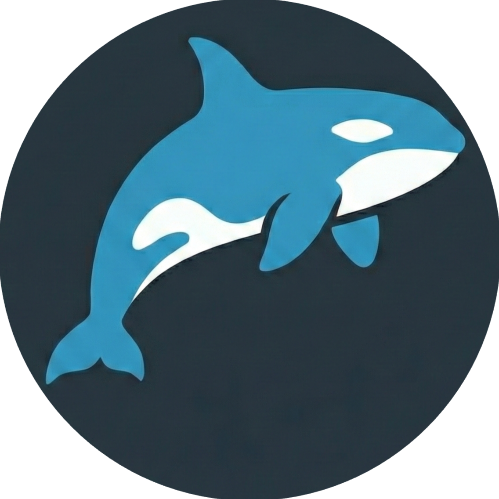

# Orca: Autonomous Software Orchestrator



## Vision

The goal is to create a platform for orchestrating a team of AI agents that collaborate to build software. The system uses a **Centralized State** architecture where agents collaborate on a shared state rather than just chatting. It features a **Human-in-the-Loop Dashboard** for monitoring, state editing, and intervention.

The vision is to move beyond simple chat-based assistants to a fully agentic software development lifecycle where AI agents act as robust team members, capable of planning, executing, and reviewing code with human oversight.

## Architecture Overview

### 1. The "Blackboard" (Centralized State)

The system uses a shared data store as the Single Source of Truth.

- **Work Items:** Structured records defining the unit of work (Status, Priority, Assignments).
- **Artifacts:** Flexible storage for work products (code changes, specs, diagrams).
- **Audit Log:** Chronological feed of all system events.

### 2. Agent Execution Environment

Agents operate within an isolated runtime to ensure security and consistency.

- **Isolation:** Sandboxed environment containing the target project's source code.
- **Tool Interfaces:** Standardized connectors for Filesystem, State, and Terminal access.

### 3. Orchestration Control Plane

Manages the lifecycle of tasks and agents using an Event Loop and Job Dispatcher.

### 4. Control Dashboard

Human-in-the-Loop interface for monitoring and intervention, featuring a Live Feed and Kanban Board.

## Technology Stack

- **Frontend:** Angular 18+ (Zoneless & Signals) with Angular Material.
- **API Framework:** NestJS.
- **Database:** PostgreSQL + pgvector (for semantic memory).
- **Repo Strategy:** Nx Monorepo.
- **Agent Logic:** LangGraph.
- **Tool Protocol:** Model Context Protocol (MCP).

## Installation & Initialization

### Prerequisites

- Node.js (v20+)
- Docker (for database and agent runtime)

### Getting Started

1. **Clone the repository**

   ```bash
   git clone <repository-url>
   cd orca
   ```

2. **Install dependencies**

   ```bash
   npm install
   ```

3. **Start the development servers**

   This project uses Nx. You can start the client and server individually or together.

   **Start Client (Angular):**

   ```bash
   npm run start:client
   # or
   npx nx serve client
   ```

   **Start Server (NestJS):**

   ```bash
   npm run start:server
   # or
   npx nx serve server
   ```

4. **Storybook**
   To view the design system components:
   ```bash
   npm run storybook
   ```

## Database & Prisma

This project uses PostgreSQL and Prisma ORM.

### 1. Start the Database

A `docker-compose.yml` is provided at the root to start a local PostgreSQL instance:

```bash
docker compose up -d
```

### 2. Generate Prisma Client

To ensure the TypeScript server and local builds have the latest types, you must generate the client locally.

```bash
npx nx prisma-generate api
```

> [!NOTE]
> The generated client is stored locally in `apps/api/prisma/client` and is ignored by git. This ensures maximum stability for IDE synchronization.

## Running Tasks

To run tasks with Nx use:

```bash
npx nx <target> <project-name>
```

For example:

```bash
npx nx build client
npx nx test server
```
